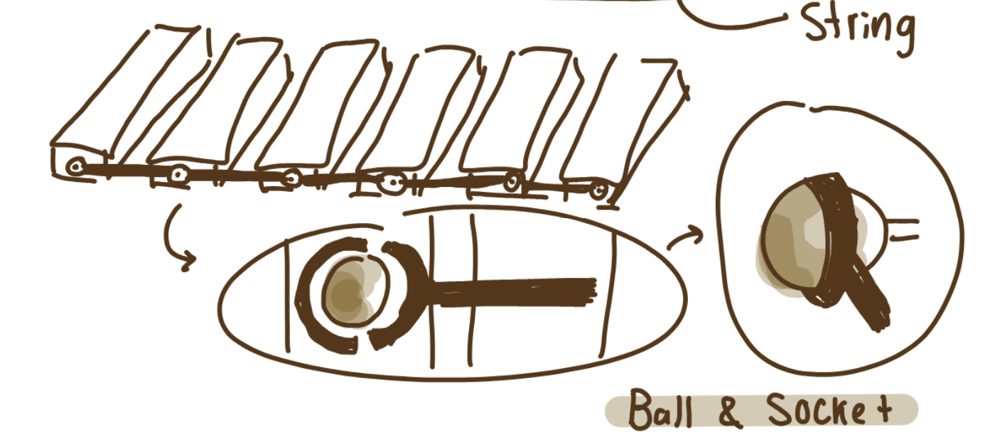
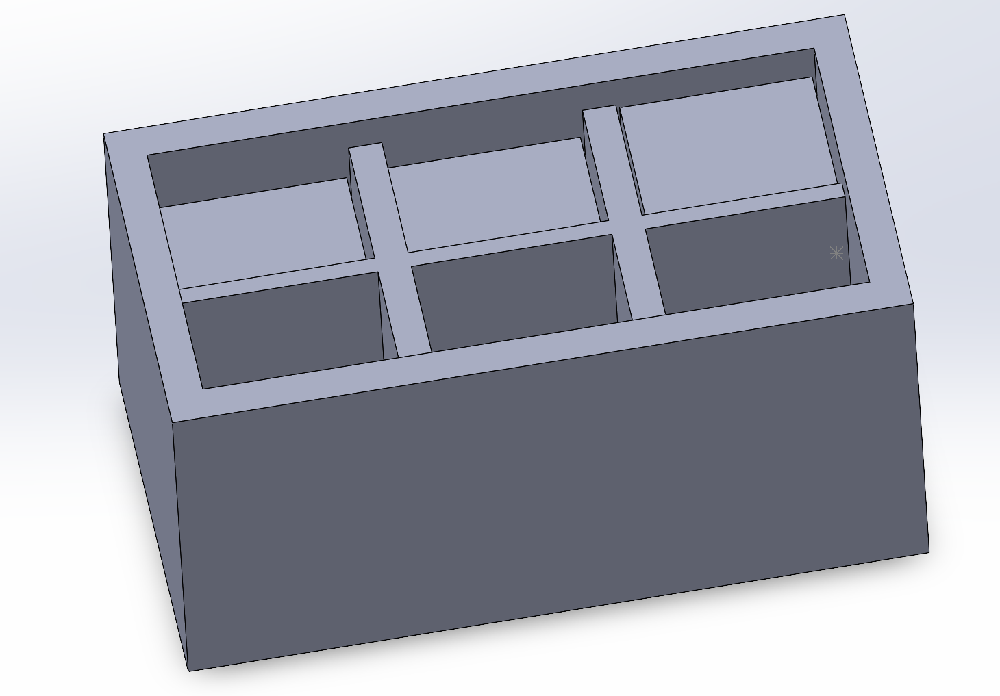

# Current Progress

The following contains the work that has been completed for this project up to: 8/30/2024

## Design Process

The design process for this project was extensive and underwent a handful of changes. The following briefly explains the changes it went through:

### 1. Three conceptual sketches.

I first began my process like I begin many of my design projects: with conceptual ideas. I first noted the things I needed from this project:

Functions:

- Move the salad up/down
- Move the salad left/right (I later decided this wasn't needed)
- Contain the salad

Non-Functional Requirements: 

- Short enough for Lizards to eat easily from it
- Not incredibly deep

Constraints:

- Cannot risk anything getting caught in the mechanism
- Must not tear the salad as it moves

Considering all of these factors, I designed these three sketches:

  

  Design 1: Flexible base that can move like a "worm"

  

  Design 2: A rod that moves in an organic path

  

  Design 3: Simple up and down movements

At this point, the sketches didn't go into depth and the mechanism weren't thoroughly thought out. However, I was very content with the idea of Design 1 as this one met ALL of my criteria and seemed to be fairly easy to automate.

### 2. Fixating on Design 1

I was ready to explore how to get Design 1 to work. I though of how I could ensure the base was flexible such as cutting ridges in a long rectangle, connecting various panels with string, or even with a ball and sockets. These sketches can be seen below:

  

    Design 1.1: Ridges in rectangle

  

    Design 1.2: Connected by string

  

    Design 1.3: Connected by ball and socket

I Decided that Design 1.1 would be the most interesting to work with... as well as the best for manufacturing. I planned on autoamting this movement by using a motor, a few gears, and spinning "Tear drop-shaped" pieces to move the base in a sinusoidal wave. With this in mind, I created a CAD of this part:

   

   CAD for a flexible base using ridges in a rectancle (Design 1.1)

Although it seemed plaussible to continue with design, I eventually decided that it was very difficult to get this base to be flexibe on such a small scale. Since I wanted this to be an appropriate size for a bowl, I couldn't think of a way to achieve the amount of flexibility I desired. Eventually, I decided to scrap this idea.

### Moving onto Design 3

As I scrapped Design 1, I began to think more about what exactly would mimick a bug in a salad. I had spent so much time wanting a "worm-like" movement (like a sinusoidal one) when in fact, this wouldn't mimick a bug at all. Smaller, quicker, movements would. This realization helped me begin to work more towards Design 3. 

Design 3 was fairly straightforward: It would be a rectangular bowl with various "tiles". These tiles would move up and down, movement facilitated by a mechanism similar to that of Design 1. Using a simple DC motor, some gears, a long shaft, and "Tear drop-shaped" pieces, the tiles would move up and down to mimick bugs in the bowl. A clear sketch of this can be seen below:

   

   Example of how the movement would be facilitated for one of the rows of tiles.

   

   Example of how the movement would be facilitated with various shafts

Upon furhter consideration, I decided that a 2x4 set of tiles would be the most optimal. An example layout for this could be seen below:

   

   Sketch of potential layout of tiles

### Begninning the CAD work

As I had the design down, I began to work on a CAD for design 3. I created each individual part and assembled it into a SolidWorks assembly:

   

   CAD of Assembly: showcases case with one row of tiles in place

   

   CAD of Assembly: showcases the mechanism used inside

### Prototyping:

(WIP)

### Electronics:

(WIP)

Some sketches have been created to showcase how I (hope) to attach the electronics within the product. This design can be seen below:

   

   Potential layout for where the electronics will be placed (battery, motor (empty rectangle), gears (brown rectangles), switch)

## Notes:
This project is still a WIP. Prototyping will be done ASAP. Stay tuned!

